# Sample Projects and workflows

2D Animation Samples are distributed with the 2D Animation package and can be imported via the Package Manager under **Samples**. The samples contain examples of different Projects with specific types of setups and detail how to achieve different desired outcomes. The samples will be installed to *Assets/Samples/2D Animation/[X.Y.Z]/Samples*, where [X.Y.Z] is version of 2D Animation the Samples were imported for.

<br/>Select **Import** to download and install the Sample Projects and Assets.

The following samples are available with the 2D Animation package. Select from the list below to view each Sample's respective documentation that explain the different processes and features used:

- [Simple single Sprite rig](ex-simple.md)
- [Single skinned Sprite](#single-skinned-sprite)
- [Multiple Sprites from a single imported Texture](#multiple-skinned-sprites)
- [Rigging a character imported with the PSD Importer](#PSDImportedRig)
- [Sprite Swap](#sprite-swap)
- [Animated Swap](#animated-swap)
- [Part Swap](#part-swap)
- [Full Skin Swap](#full-skin-swap)
- [DLC Swap](#dlc-swap)
- [Skeleton Sharing](#skeleton-sharing)
- [Runtime Swap](#runtime-swap)

## Simple

This sample shows a simple 2D Sprite rig using the Texture Importer set to **Single Sprite Import** mode.


To view how the Sprite is rigged, open the Asset *Assets/Samples/2D Animation/[X.Y.Z]/Samples/1 Simple/Sprites/Boris.png* in the Skinning Module.


The *_Simple* sample Scene shows how the Asset is used in a Scene with animation using deformation.


The following are the steps to reconstruct the *_Simple* sample Scene

1. Create a new Scene.

2. Create a GameObject and call it Root.

3. Create a GameObject and call it Boris.

4. Place the Boris GameObject as a child or the Root GameObject.

5. In Boris GameObject, add a Sprite Renderer component.

   * Assign the Boris Sprite to the Sprite Renderer’s Sprite property

6. In Boris GameObject, add a Sprite Skin component.

   * On the Sprite Skin component, select the **Create Bones** button.
   * This will create GameObject Transforms to represent the bones for the Sprite.


7. On the Root GameObject, add a Animator component
   * In the Animator’s Controller property, assign the Root Animator Controller Asset located in *Assets/Samples/2D Animation/[X.Y.Z]/Samples/1 Simple/Animation/Animator/Root.controller*
8. On the Boris GameObject, add a Animator component

   * In the Animator’s Controller property, assign the Boris Animator Controller Asset located in *Assets/Samples/2D Animation/[X.Y.Z]/Samples/1 Simple/Animation/Animator/Boris.controller*

## Single skinned Sprite

This sample shows a slightly more complicated 2D Sprite rig which contains bone branching using Sprite imported by the Texture Importer set to **Single Sprite Import** mode.


To view how the Sprite is rigged, open the Asset *Assets/Samples/2D Animation/[X.Y.Z]/Samples/2 Single Skinned Sprite/Sprites/Plunkah.png* in the Skinning Module.

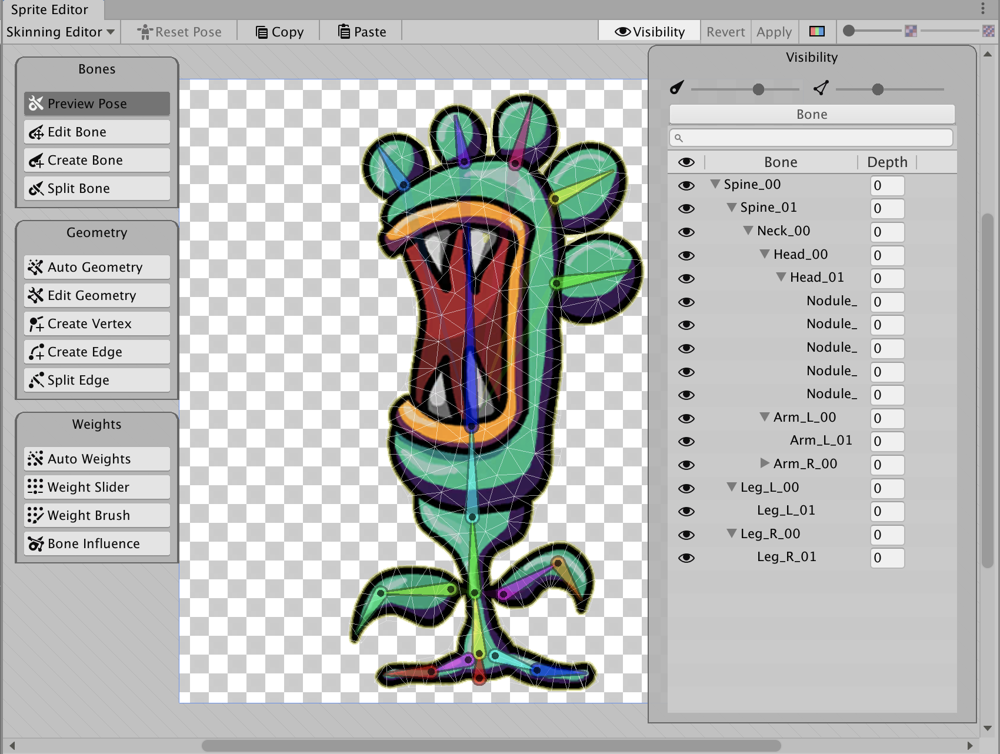

The *_Single Skinned Sprite *sample Scene shows how the Asset is used in a Scene with animation using deformation.


The following are the steps to reconstruct the *_Single Skinned Sprite* sample Scene

1. Create a new Scene.
2. Create a GameObject and named it Plunkah.
3. Add a Sprite Renderer component and assign the Plunkah Sprite to the Sprite property.
4. Add a Sprite Skin component and select the **Create Bones** button.
5. Add a Animator component and assign the Plunkah Animator Controller Asset to the Controller property.

### Multiple skinned Sprites

This sample shows a rigged character that is made out of multiple Sprites. The Sprites are from a single image imported with the Texture Importer set to **Multiple Sprite Import** mode.


To view how the Sprite is rigged, open the Asset *Assets/Samples/2D Animation/[X.Y.Z]/Samples/3 Multiple Skinned Sprites/Sprites/Rikr.png* in the Skinning Module.

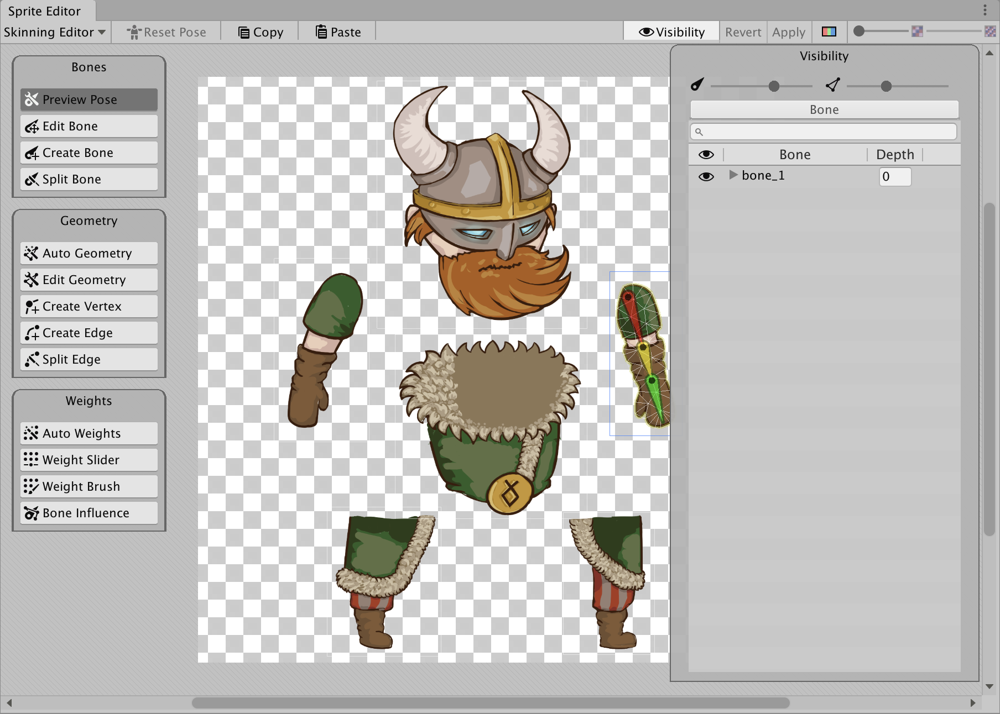

The *_Multiple Skinned Sprites* sample Scene shows how the Asset is used in a Scene with animation using deformation.


The following are the steps to reconstruct the *_Multiple Skinned Sprites Sprite* sample Scene:

1. For each Sprite in *Rikr *Asset:

   1. Create a GameObject with a Sprite Renderer referencing the Sprite.
   2. Add a Sprite Skin component and select the **Create Bones** button.
      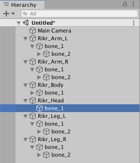

2. Reconstruct the character’s hierarchical structure so that the part of the character moves in conjunction with the body part it is supposed to link to. For example, when the body is moving, the rest of the character part should follow.

   - Using *Rikr_Body* as the root, place *Rikr_Leg_L* and *Rikr_Leg_R* GameObject as children of *Rikr_Body/bone_1*

   - Using *Rikr_Body* as the root, place *Rikr_Arm_L*, *Rikr_Arm_R* and *Rikr_Head* GameObject as children of *Rikr_Body/bone_2*

     

3. Place the GameObjects with Sprite Renderers so that they are aligned correctly. To control the Sprite drawing order, specify the **Order In Layer** value in Sprite Renderer.

   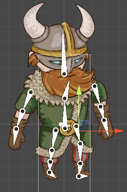


4. Create another GameObject at the root and call it Rikr_Root. Reparent the Rikr_Body GameObject to be a child of Rikr_Root.
5. Add an Animator component to the Rikr_Root GameObject and assign the Rikr Animator Controller Asset to the Controller property. The Animator Controller Asset is located at *Assets/Samples/2D Animation/[X.Y.Z]/Samples/3 Multiple Skinned Sprites/Animation/Animator/Rikr*

## <a name="PSDImportedRig">Rigging a character imported with the PSD Importer</a>

This example shows how to rig a character that consists of multiple Sprites using PSDImporter with Character Import mode. For this example to work, the PSDImporter package needs to be installed.


To view how the Sprite is rigged, open the Asset *Assets/Samples/2D Animation/[X.Y.Z]/Samples/4 Character/Sprites/Fei.psb* in the Skinning Module.

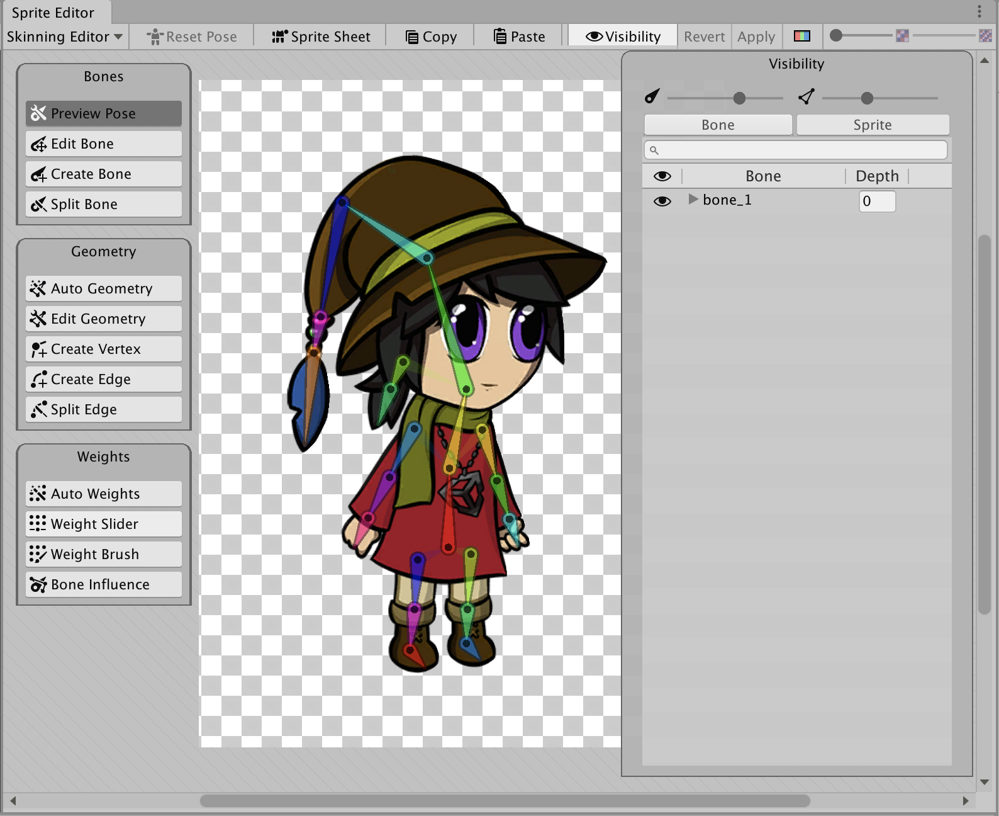

The *_Character *sample Scene shows how the Asset is used in a Scene with animation using deformation.

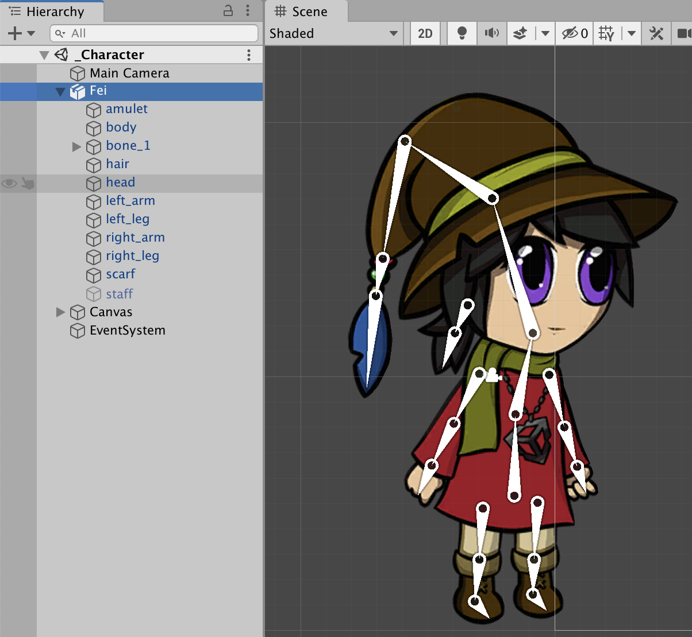

The following are the steps to reconstruct the *_Character* sample Scene

1. In PSD Importer’s **Character** mode, a Prefab is generated as a sub asset which has the GameObjects setup with Sprite Renderers and Sprite Skin. Thus to reconstruct the Scene, simply drag the Prefab generated from `Assets/Samples/2D Animation/[X.Y.Z]/Samples/4 Character/Sprites/Fei.psb` into the Scene.
2. Add an Animator Component on the Fei GameObject and assign the Fei Animator Controller Asset located at `Assets/Samples/2D Animation/[X.Y.Z]/Samples/4 Character/Animation/Animators/Fei.controller` to the controller property.

## Sprite Swap

This collection of examples show how to achieve different Sprite Swap outcomes.


### Flipbook Animation Swap

This example shows how to use Sprite Swap to create reusable Animation Clip for Flipbook animation. Open the Scene `1 Flipbook Animation Swap` to see it in action.

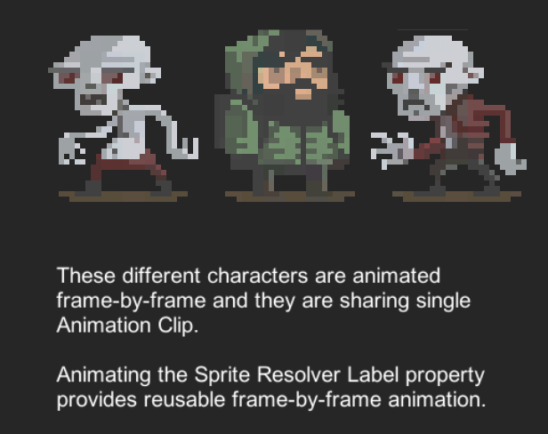

In the example, it uses 3 Sprite Library Assets that are located at `Assets/Samples/2D Animation/[X.Y.Z]/Samples/5 Sprite Swap/Sprite Library` and they are:

1. Hero.spriteLib

2. Zombie1.spriteLib

3. Zombie2.spriteLib

Each of the Sprite Library Assets uses the respective Sprites from `Scavengers_SpriteSheet.png` located in `Assets/Samples/2D Animation/[X.Y.Z]/Samples/5 SpriteSwap/Sprites`. Each Sprite Library Asset also has the same number of categories with the same name and the entries in each category also have the same name.

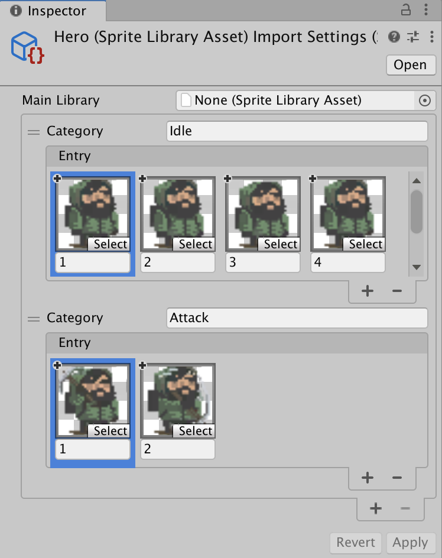

The following are the steps to reconstruct the *1 Flipbook Animation Swap* sample Scene

1. Create a GameObject called Hero.

   1. Add a Sprite Renderer component in the GameObject and set the Sprite property to one of the Sprites used in `Hero.spriteLib`.

   2. Add a Sprite Library component and assign the `Hero.spriteLib` in the **Sprite Library Asset** property.

   3. Add a Sprite Resolver component.

2. Add a Animation component and assigned the Scavengers Animation clip located in `Assets/Samples/2D Animation/[X.Y.Z]/Samples/5 SpriteSwap/Animation` into the Animation property.

3. Duplicate the Hero GameObject and name it `Zombie1`.

   - In the Sprite Renderer, set the **Sprite** property to one of the Sprites used in `Zombie1.spriteLib`.

4. Duplicate the Hero GameObject can call it `Zombie2`.

   - In the Sprite Renderer, set the **Sprite** property to one of the Sprites used in `Zombie2.spriteLib`

Observe that all 3 GameObjects use the same Animation Clip. However, when the Animation Clip is being played, all 3 GameObjects are switching to a different Sprite. This is because the Animation Clip is not animating the **Sprite** property of the Sprite Renderer but rather the Sprite the Sprite Resolver should resolve from the Sprite Library component. Thus this makes Animation Clip reusable as long as the Sprite Library or the Sprite Library Asset contains the category and entry the Sprite Resolver needs.

### Animated Swap

This example shows how to use Sprite Swap to create reusable Animation Clip for animation that requires swapping of visuals in an animation with deformation. For this example to work, the PSD Importer package needs to be installed. Open the Scene file `2 Animated Swap`to see it in action.


This uses the same concept in the Flipbook Animation Swap example. The example uses 2 different visuals located in `Assets/Samples/2D Animation/[X.Y.Z]/Samples/5 SpriteSwap/Sprites`. The example assets used are:

1. `dialog.psb`

2. `dialog gray.psb`

These assets are imported with the PSD Importer set to **Character** mode and rigged in the same way. Each asset also have 2 different hand Sprites that can be swapped during the animation.

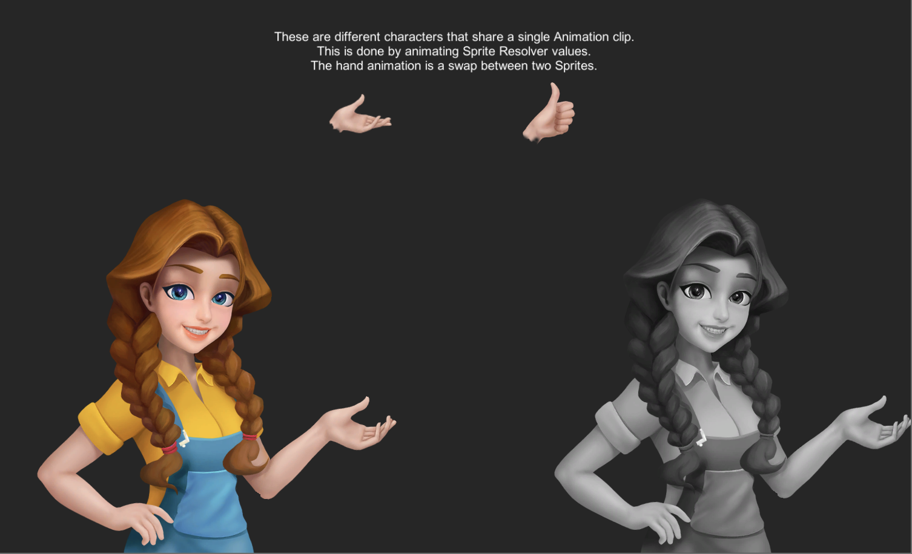

Using the same technique in Flipbook Animation Swap, 2 Sprite Library Assets are created. They are located at `Assets/Samples/2D Animation/[X.Y.Z]/Samples/5 Sprite Swap/Sprite Library` and stored as:

1. `dialog.spriteLib`

   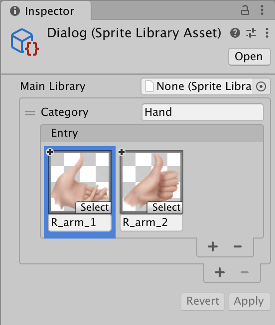


2. `dialog gray.spriteLib`

   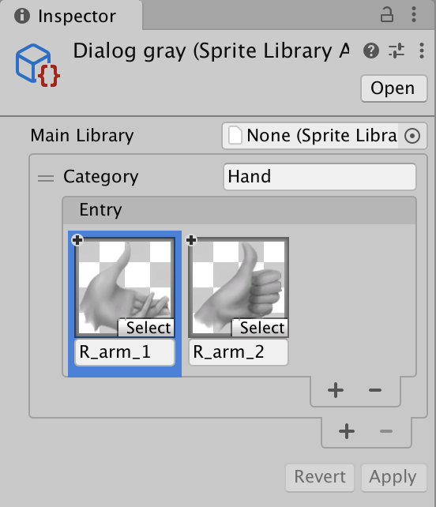


The following are the steps to reconstruct the sample Scene:

1. Instantiate both `dialog` and `dialog gray` Prefab into the Scene.

2. On the `dialog` GameObject, add a Sprite Library component and assign the `dialog.spriteLib` Asset into the **Sprite Library Asset** property.

3. On the `dialog gray` GameObject, add a Sprite Library component and assign the dialog `gray.spriteLib` Asset into the **Sprite Library Asset** property.

4. Expand the dialog GameObject and look for `R_arm_2` GameObject and disable it. The asset is not needed since it will be swapped in during the animation.

5. In `R_arm_1`, add a Sprite Resolver Component and set it to use the `R_arm_2`.

   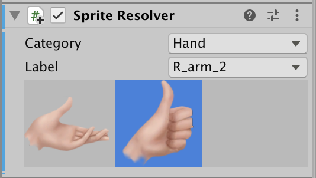

6. Repeat steps 4 and 5 with the `dialog gray` GameObject.

7. Add a Animator controller on both GameObjects and assign the Dialog Animator Controller asset located in `Assets/Samples/2D Animation/[X.Y.Z]/Samples/5 Sprite Swap/Animation/Animators` into the **Controller** property.

Observe that in this example, the Sprite Library component is not on the same GameObject as the Sprite Resolver. Sprite Resolver will attempt to locate a Sprite Library component starting from the same GameObject it is on and traverse up the GameObject hierarchy. This way it is possible to have one or many Sprite Resolvers to use the same Sprite Library component by having the Sprite Library component on a common root GameObject of the Sprite Resolvers.

### Part Swap

This example shows how to swap Sprite assets using the API provided by changing the Sprite Resolver data. This example uses the visual setup in the Multiple Skinned Sprites example. Open the  `3 Part Swap` Scene to see it in action.


In the Scene, each part has 3 different visual options that can be swapped. The graphic assets are located in `Assets/Samples/2D Animation/[X.Y.Z]/Samples/5 SpriteSwap/Sprites`:

1. `Rikr.png`
2. `Rikr Poison.png`
3. `Rikr Rage.png`

A Sprite Library Asset is set up to where each visual that is interchangeable is in the same category. The Asset is located at `Assets/Samples/2D Animation/[X.Y.Z]/Samples/5 SpriteSwap/Sprite Library/Rikr Full.spriteLib`.

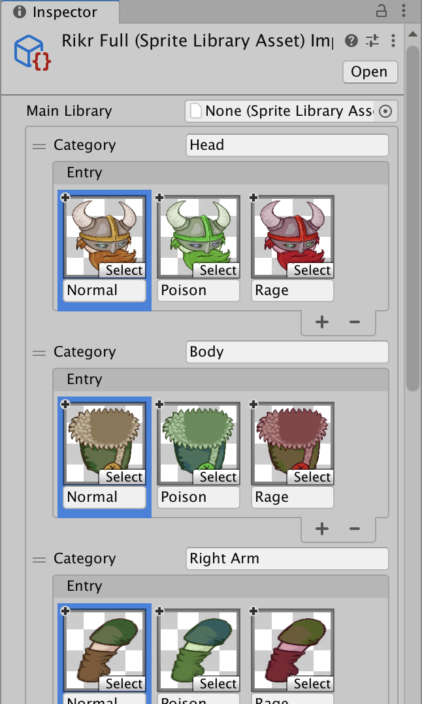

On the `Rikr_Root` GameObject in the Scene, a Sprite Library component is added and its **Sprite Library Asset** property is set to reference the `Rikr Full.spriteLib` Asset.

In all Sprite Renderers under the `Rikr_Root` GameObject, a Sprite Resolver is added and is set to use the appropriate Sprite. For example, the Sprite Resolver for the `Rikr_Body` GameObject, the Sprite Resolver is set to use one of the Body Sprites.

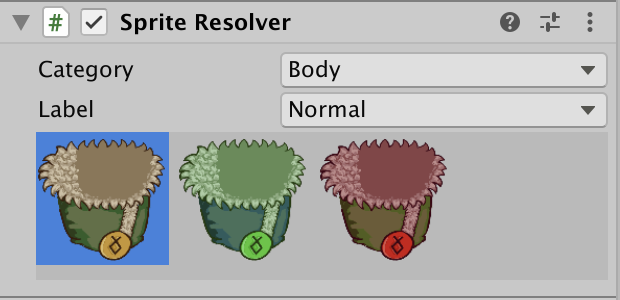

#### Swap Part Script

A custom MonoBehaviour script called `Swap Part` is attached to the `Rikr_Root` GameObject. The script is located at `Assets/Samples/2D Animation/[X.Y.Z]/Samples/5 SpriteSwap/Scripts/Runtime/SwapPart.cs`.

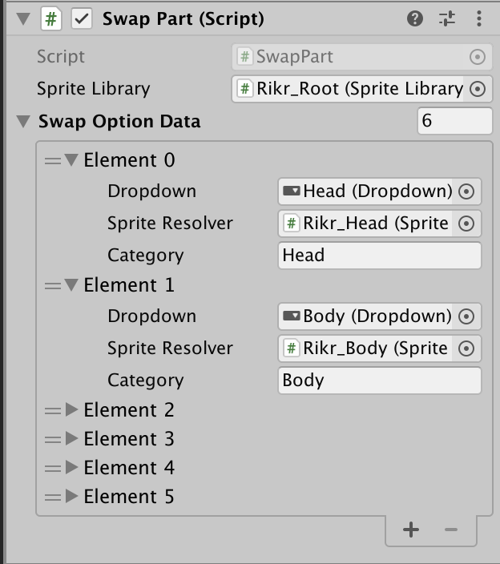

The script holds a reference to a Sprite Library component for retrieval of swappable Sprites. It also holds an array of data that describes the category of Sprites in the Sprite Library that can be changed by a Sprite Resolver.

When the Swap Part script starts up, it will attempt to fetch the Sprite Library Asset that is used by a Sprite Library component.

```c++
var libraryAsset = spriteLibrary.spriteLibraryAsset;
```

From the Sprite Library Asset, it will then fetch the entries name that are in the category

```c++
var labels = libraryAsset.GetCategoryLabelNames(swapOption.category);
```

This is then used to populate the UI Drop Down list.

When there is a value changed in the UI Drop Down List, it will then set the Sprite Resolver to use the relevant Sprite

```c++
swapOption.spriteResolver.SetCategoryAndLabel(swapOption.category, swapOption.dropdown.options[x].text);
```


### Full Skin Swap

This example shows how to swap Sprite visuals using the API provided by changing the Sprite Library Asset referenced by the Sprite Library component. This example uses the visual setup in the Multiple Skinned Sprites example. Open the `4 Full Swap` Scene to see it in action.

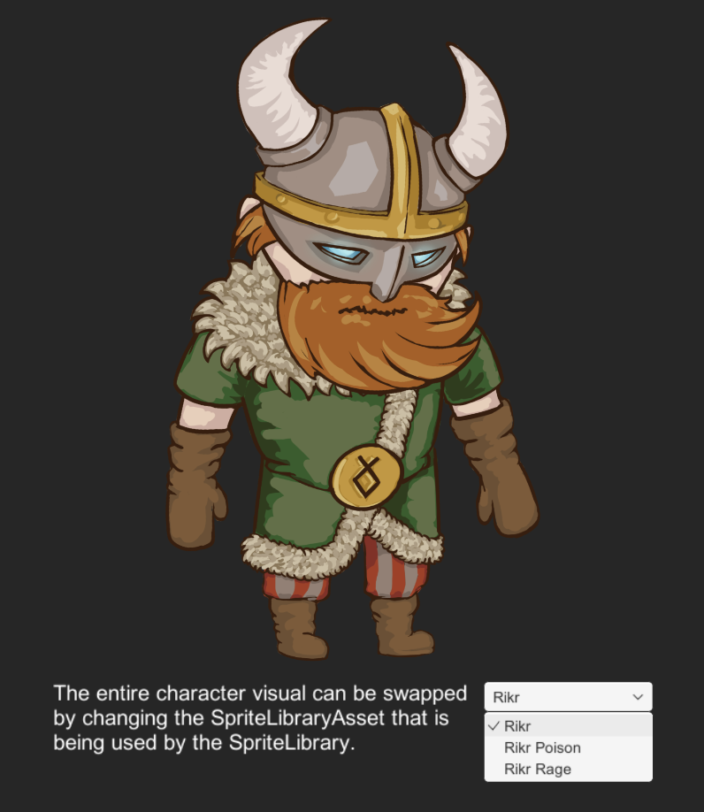

In the Scene, there are 3 different visual asset options that can be swapped. The assets are located in `Assets/Samples/2D Animation/[X.Y.Z]/Samples/5 SpriteSwap/Sprites`:

1. `Rikr.png`
2. `Rikr Poison.png`
3. `Rikr Rage.png`

Sprite Library Assets are set up to have identical categories and entries names but with a different Sprite reference. The asset are located at `Assets/Samples/2D Animation/[X.Y.Z]/Samples/5 SpriteSwap/Sprite Library`.

1. `Rikr.spriteLib`

2. `Rikr Posion.spriteLib`

3. `Rikr Rage.spriteLib`

On the `Rikr_Root` GameObject in the Scene, a Sprite Library component is added and its Sprite Library Asset property is set to reference the `Rikr.spriteLib` Asset.

On the individual Sprite Renderers under `Rikr_Root` GameObject, a Sprite Resolver is added and is set to use the appropriate Sprite. For example, the `Rikr_Body` GameObject, the Sprite Resolver is set to use the Body Sprite.

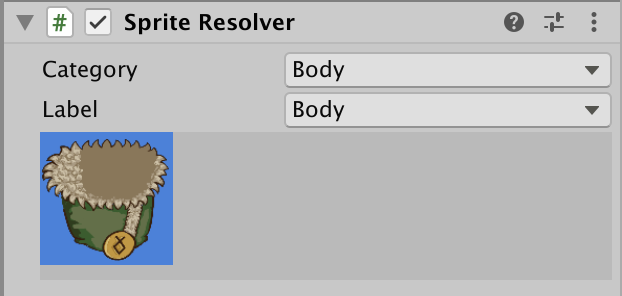

#### Swap Full Skin Script

A custom MonoBehaviour script called the `Swap Part` is attached to the` Rikr_Root` GameObject. The script is located at `Assets/Samples/2D Animation/[X.Y.Z]/Samples/5 SpriteSwap/Scripts/Runtime/SwapFullSkin.cs`

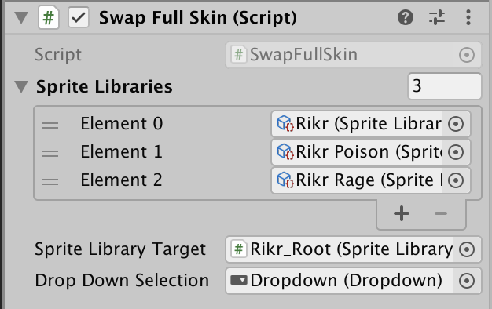

Where there is a value change in the UI Drop Down List, the component sets the relevant Sprite Library Asset to be used for the Sprite Library component.

```c++
spriteLibraryTarget.spriteLibraryAsset = spriteLibraries[value];
```

### DLC Swap

This example shows how to swap Sprite visuals using the API provided by changing the Sprite Library Asset referenced by the Sprite Library component. This example uses the visual setup in the Multiple Skinned Sprites example and builds on top of the Full Skin Swap example. However, instead of the Sprite Library Assets are referenced in Swap Full Skin component, it is loaded from an AssetBundle during runtime and added into the component later. Open the  `5 DLC Swap` Scene to see it in action.

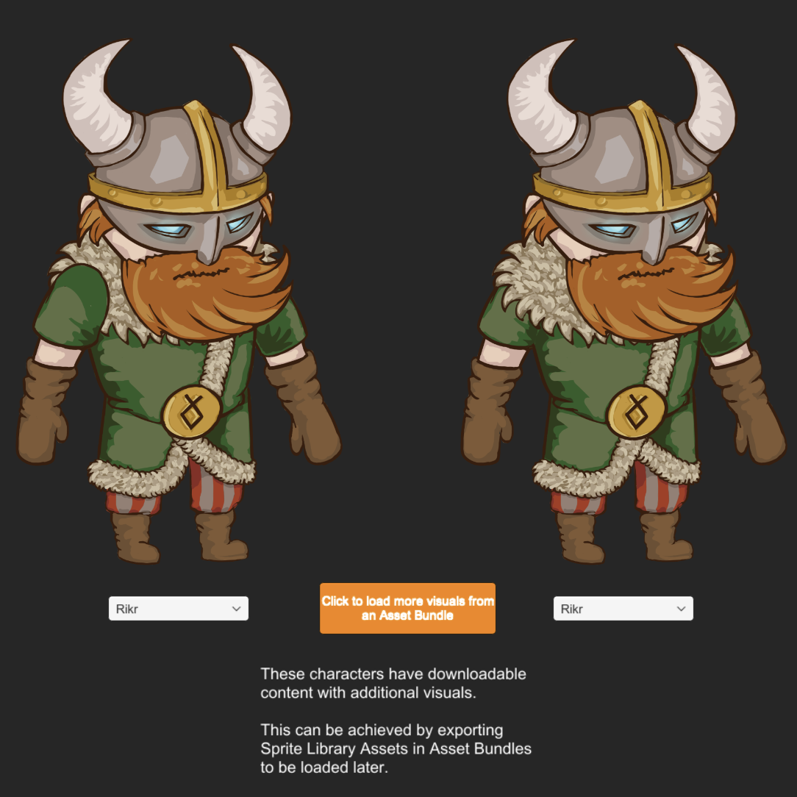

For more information about Asset Bundles, please refer to the [AssetBundle Manual](https://docs.unity3d.com/Manual/AssetBundlesIntro.html).

For the Asset Bundle to work, the `Rikr_Poison.spriteLib` and `Rikr_Rage.spriteLib` Asset in `Assets/Samples/2D Animation/[X.Y.Z]/Samples/5 SpriteSwap/Sprite Library` are labeled in their relevant AssetBundle tag.


#### Load Swap DLC Script

A custom MonoBehaviour script called `Load Swap DLC` is attached to the Load DLC GameObject. The script is located at `Assets/Samples/2D Animation/[X.Y.Z]/Samples/5 SpriteSwap/Scripts/Runtime/LoadSwapDLC.cs`

The script is set up when the DLC is loaded, it will scan the AssetBundles for any Sprite Library Assets. Once the Sprite Library Assets are loaded, it will add these entries into the `Swap Full Skin` script from the previous example.

### Skeleton Sharing

This example shows how Skeleton Sharing can be set up and leverages on the examples before this. The example requires the PSD Importer package to be installed. Open the `5 Skeleton Sharing` Scene to see it in action.


The example setup is the same as the [Full Skin Swap](#full-skin-swap) example. However instead of using Multi Skinned Sprites, the example uses the Prefab generated by the PSD Importer. The art assets are located in `Assets/Samples/2D Animation/[X.Y.Z]/Samples/5 SpriteSwap/Sprites`:

1. `Primary.psb`

2. `Variant.psb`

The `Variant.psb` is set up to use the Skeleton asset from the `Primary.psb` to showcase that the `Variant.psb` is prepared using the same skeleton structure as the `Primary.psb`.


It also uses the following Sprite Library Asset located in `Assets/Samples/2D Animation/[X.Y.Z]/Samples/5 SpriteSwap/Sprites`:

1. `Primary.spriteLib`

2. `Variant.spriteLib`

The `Variant.spriteLib` is set up to use the `Primary.spriteLib` as the Main Library property. In the `Variant.spriteLib`, it is also set up purposely that the **torso** category is not overridden so that it uses the Sprite from `Primary.spriteLib`.


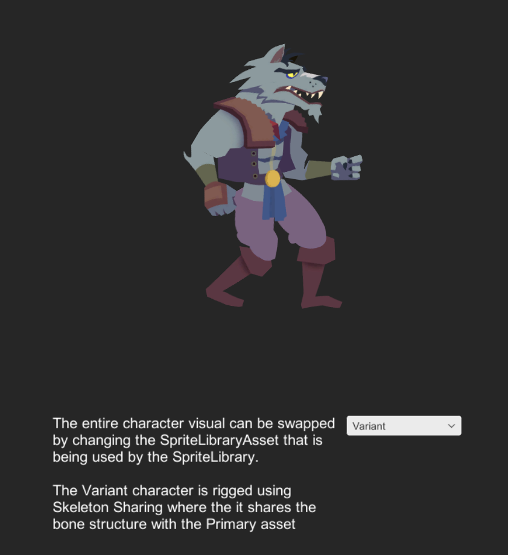

### Runtime Swap

This example shows how to use the Sprite Library API to override an entry. The example requires the PSD Importer package to be installed. Open the `6 Runtime Swap` Scene to see it in action.


The graphic assets are located in `Assets/Samples/2D Animation/[X.Y.Z]/Samples/5 SpriteSwap/Sprites`:

1. `Primary.psb`

2. `Skeleton.psb`

`Skeleton.psb` uses the Skeleton Asset from `Primary.psb` for rigging. It also uses the `Primary.spriteLib` Sprite Library Asset located in `Assets/Samples/2D Animation/[X.Y.Z]/Samples/5 SpriteSwap/Sprites`.

#### Runtime Swap script

A custom MonoBehaviour script called the `Runtime Swap` is attached to the KnigtboyRig GameObject. The script is located at `Assets/Samples/2D Animation/[X.Y.Z]/Samples/5 SpriteSwap/Scripts/Runtime/RuntimeSwap.cs`

When a button that represents the Sprite from the Skeleton.psb is pressed, the script will use the override API from Sprite Library to override the Sprite entry.

```c++
m_SpriteLibraryTarget.AddOverride(entry.sprite, entry.category, entry.entry);
```

When one of the buttons that represents the Sprite from the Primary.psb is pressed, the script will use the override rest API from the Sprite Library to remove the Sprite entry override.

```c++
m_SpriteLibraryTarget.RemoveOverride(entry.category, entry.entry);
```
